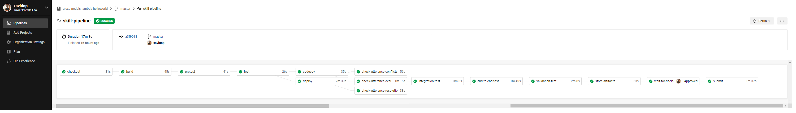

[](https://codecov.io/gh/xavidop/alexa-nodejs-lambda-helloworld)

# DevOps your Skill

"DevOps is the union of people, process, and products to enable continuous delivery of value to our end users." - Donovan Brown, Microsoft

DevOps is a "culture" which have a set of practices that combines software development (Dev) and information-technology operations (Ops) which aims to shorten the systems development life cycle and provide continuous delivery with high software quality. DevOps culture develops "production-first mindset". 
In terms of Alexa, DevOps can help us to quickly ship the highest quality of our Skill to the end customers.
This post contains materials from different resources that can be seen on Resources section.

## Prerequisites

Here you have the technologies used in this project
1. Amazon Developer Account - [How to get it](http://developer.amazon.com/)
2. AWS Account - [Sign up here for free](https://aws.amazon.com/)
3. ASK CLI - [Install and configure ASK CLI](https://developer.amazon.com/es-ES/docs/alexa/smapi/quick-start-alexa-skills-kit-command-line-interface.html)
4. CircleCI Account -  [Sign up here](https://circleci.com/)
5. Visual Studio Code

The Alexa Skills Kit Command Line Interface (ASK CLI) is a tool for you to manage your Alexa skills and related resources, such as AWS Lambda functions.
With ASK CLI, you have access to the Skill Management API, which allows you to manage Alexa skills programmatically from the command line.
If you want how to create your Skill with the ASK CLI, please follow the first step explained in my [Node.js Skill sample](https://github.com/xavidop/alexa-nodejs-lambda-helloworld). 
We are going to use this powerful tool to do some steps in our pipeline. Let's DevOps!

## Dockerfile

Before explain the pipeline, it is important to explain the Docker image we are going to use in this pipeline. 
You can find all the explanation in [this repo](https://github.com/xavidop/alexa-ask-aws-cli-docker).

## Pipeline



Before explain the pipeline, it is worth noting the common part of the pipeline, the executor. An executor defines the underlying technology or environment in which to run a job. Set up your jobs to run in the docker, machine, macos or windows executor and specify an image with the tools and packages you need.
In our case, we will use a docker executor using the docker image explained above:

```yaml
  executors:
    ask-executor:
      docker:
        - image: xavidop/alexa-ask-aws-cli:1.0
```

Let's explain job by job what is happening in our powerful pipeline. 
First of all, each box represented in the image above is a job and they will be defined below the `job` node in the CircleCI configuration file:

### Checkout

The checkout job will execute the following tasks:
1. Checkout the code in `/home/node/project`
2. Bring execution permission to `node` user to be able to execute all the hooks
3. Persist the code in order to reuse it in the next job

```yaml
  checkout:
    executor: ask-executor
    steps:
      - checkout
      - run: chmod +x -R ./hooks
      - persist_to_workspace:
          root: /home/node/
          paths:
            - project
```

### Build

The build job will execute the following tasks:
1. Restore the code that we have downloaded in the previous step in `/home/node/project` folder
2. Run `npm install` in order to download all the Node.js dependencies, including dev dependencies.
3. Persist again the code that we will reuse in the next job

```yaml
  build:
    executor: ask-executor
    steps:
      - attach_workspace:
          at: /home/node/
      - run: ls -la
      - run: cd lambda/custom && npm install
      - persist_to_workspace:
          root: /home/node/
          paths:
            - project

```

### Pretests

The pretest job will execute the static code quality check. Check the full explanation [here](docs/ESLINT.md).

### Test

The test job will execute the unit tests. Check the full explanation [here](docs/UNITTESTS.md).

### Code Coverage

The codecov job will execute the code coverage report. Check the full explanation [here](docs/CODECOV.md).

### Deploy

The deploy job will execute the following tasks:
1. Restore the code that we have used in the previous step in `/home/node/project` folder
2. Copy the `package.json` to `src/` folder.
3. Execute the `npm run build-production` command that will install only the production libraries in the `src/` folder.
4. Run `ask deploy --debug --force` that will deploy all the code in `src/` folder as an AWS lambda.
5. Persist again the code that we will reuse in the next job

```yaml
  deploy:
    executor: ask-executor
    steps:
      - attach_workspace:
          at: /home/node/
      - run: cd lambda/custom && npm run copy-package
      - run: cd lambda/custom/src && npm run build-production
      - run: ask deploy --debug --force
      - persist_to_workspace:
          root: /home/node/
          paths:
            - project
```
**NOTE:** If you want to run successfully every ASK CLI command, you have to set up 5 environment variables:

* `ASK_DEFAULT_PROFILE`
* `ASK_ACCESS_TOKEN`
* `ASK_REFRESH_TOKEN`
* `ASK_VENDOR_ID`
* `AWS_ACCESS_KEY_ID`
* `AWS_SECRET_ACCESS_KEY`

And configure the `__ENVIRONMENT_ASK_PROFILE__` profile in your `.ask/config` file.

How to obtain these variables and how to configure this profile are explained in [this post](https://github.com/xavidop/alexa-ask-aws-cli-docker)

### Testing the Voice User Interface

These jobs will check our interaction model. Check the full explanation [here](docs/VUITESTS.md).

### Integration tests

These jobs will check the interaction model and our backend as well. Check the full explanation [here](docs/INTEGRATIONTESTS.md).

### Store-artifacts

The store-artifacts job will execute the following taks:
1. Restore the code that we have used in the previous step in `/home/node/project` folder
2. Clean `node_modules` folder
3. Store the entire code of our Alexa Skill as an artifact. It will be accessible in CircleCI whenever we want to check it out.

```yaml
  store-artifacts:
    executor: ask-executor
    steps:
      - attach_workspace:
          at: /home/node/
      - run: ls -la
      - run: rm -rf lambda/custom/node_modules
      - store_artifacts:
          path: ./

```

### Workflow

At the end of the CircleCi configuration file, we will define our pipeline as a CircleCI Workflow which will execute the jobs explained above:

```yaml
  workflows:
    skill-pipeline:
      jobs:
        - checkout
        - build:
            requires:
              - checkout
        - pretest:
            requires:
              - build
        - test:
            requires:
              - pretest
        - codecov:
            requires:
              - test
        - deploy:
            requires:
              - test
        - check-utterance-conflicts:
            requires:
              - deploy
        - check-utterance-resolution:
            requires:
              - deploy
        - check-utterance-evaluation:
            requires:
              - deploy
        - integration-test:
            requires:
              - check-utterance-evaluation
        - store-artifacts:
            requires:
              - integration-test
```

The CircleCI configuration file is located in `.circleci/config.yml`.

## Future steps

As you notice, this is the first step of DevOps our Alexa Skill. I will be continue working on add some new jobs to these pipeline:
1. End-to-end testing with [Bespoken](https://bespoken.io/)

## Resources
* [DevOps Wikipedia](https://en.wikipedia.org/wiki/DevOps) - Wikipedia reference
* [Official Alexa Skills Kit Node.js SDK](https://www.npmjs.com/package/ask-sdk) - The Official Node.js SDK Documentation
* [Official Alexa Skills Kit Documentation](https://developer.amazon.com/docs/ask-overviews/build-skills-with-the-alexa-skills-kit.html) - Official Alexa Skills Kit Documentation
* [Official CircleCI Documentation](https://circleci.com/docs/) - Official CircleCI Documentation

## Conclusion 

This is the first step to know how to DevOps your Alexa Skills using CircleCI.
As you have seen in this example, the Alexa Tools like ASK CLI can help us a lot. We will update this readme while we are updating the pipeline.
I hope this example project is useful to you.

That's all folks!

Happy coding!
