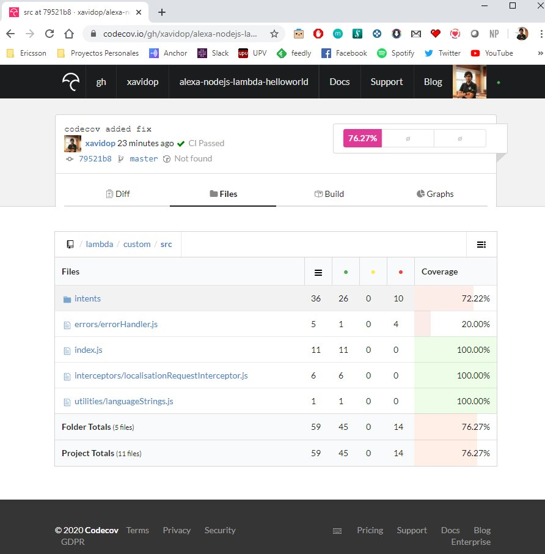

# DevOps your Skill: Code Coverage

Without a doubt, one of the aspects a developer should pay more attention is trying to always generate understandable,
maintainable and clear code, in short, to generate clean code.

During the development of code (modules, libraries) it is important to integrate objective tools that measure the status of the code and provide the information to know its quality and thus be able to detect and prevent problems: duplicate functions, excessively complex methods, code low quality, non-standard coding style.

This code coverage report is automated in the continuous integration system (CircleCI) and are executed in each new version of the software.

## Prerequisites

Here you have the technologies used in this project
1. ASK CLI - [Install and configure ASK CLI](https://developer.amazon.com/es-ES/docs/alexa/smapi/quick-start-alexa-skills-kit-command-line-interface.html)
2. CircleCI Account - [Sign up here](https://circleci.com/)
3. Codecov Account - [Register here](https://codecov.io/)
4. Node.js v10.x
5. Visual Studio Code

## Codecov

Codecov provides highly integrated tools to group, merge, archive and compare coverage reports. 
Whether your team is comparing changes in a pull request or reviewing a single commit, Codecov will improve the code review workflow and quality.
Codecov supports the most commons CICD engine like the one we use, CircleCI. 

### Configure Codecov

As the official Codecov documentation says, here are the things you'll need or want to have in place before using Codecov:

1. Sign up on [codecov.io](https://codecov.io/) and link either your GitHub, GitLab, or Bitbucket account.
2. Once linked, Codecov will automatically sync all the repositories to which you have access.
You can click on an organization from your dashboard to access its repositories, or navigate directly to a specific repository using: https://codecov.io/\<repo-provider>/\<account-name>/\<repo-name>. Example: https://codecov.io/gh/xavidop/alexa-nodej-lambda-helloworld.
3. Get the token of this repo generated by Codecov that we will use in our pipeline.

Now we can go back to our code to set up the project

### Installation

After this, we can install `codecov` Node.js uploader library using npm. `--save-dev` is used to save the package for development purpose. Example: unit tests, minification

```bash
    npm install codecov --save-dev
```

It is important to notice that the code coverage report will be generated by an external tool called `nyc` that its output will be used by this uploader library in order to upload it to Codecov. Let's go deeper!

### Configuration

Once we have `codecov` Node.js uploader library now we have to configure it.

In order to use the uploader library, we need to set an environment  variable called `CODECOV_TOKEN` with the value that Codecov has generated in the previous step.

After that we have to create the `codecov.yml` configuration file in the root of our repository with this content:

```yaml
    fixes:
      - "src/::lambda/custom/src/"
```

Why? well, our JavaScript code is not located in the root of our project so when we run the code coverage report it will start from `src/` subfolder. 
So we have to change the folder of the report to set the correct path starting from the root directory of the repo. 
With this yaml file Codecov will change all file paths from `src/` to `lambda/custom/src`.
This change is needed if you want to navigate between files in the Codecov UI online.
This is not a problem only with Codecov, I have the same issue with Coveralls tool for example.

### Code Coverage Report

Once we have everything configured, we have to set up the report we are going to use to check the Code Coverage.

We will use the npm package `nyc` which is the CLI tool of the famous npm package `Istanbul`.
Both `nyc` and `Istanbul` are the most used code coverage libraries for Node.js and JavaScript projects
 
You can install `nyc` using npm. `--save-dev` is used to save the package for development purpose. Example: linters, minification.

```bash
    npm install nyc --save-dev
```

This npm package has an option to set the output format of the report to a `.lcov` type which is the type that `codecov` Node.js uploader library needs to upload to Codecov website. 

After the report has been updated to Codecov, this is how this report looks like:



### Integration

Now it is time to integrate it into our `package.json` to use it in our pipeline with `npm run` command!

So, in this file we are going to add the following commands in the `script` json node:

1. `codecov`: this command will execute the Code Coverage report and uploads it to Codecov:
   * `nyc npm test && nyc report --reporter=text-lcov > coverage.lcov && codecov`


## Pipeline Job

Everything is fully installed, configured and integrated, let's add it to our pipeline!

This job will execute the following tasks:
1. Restore the code that we have downloaded in the previous step in `/home/node/project` folder
2. Run `npm run codecov` to execute the Code Coverage and then upload it to Codecov.
3. Persist again the code that we will reuse in the next job

```yaml
  codecov:
    executor: ask-executor
    steps:
      - attach_workspace:
          at: /home/node/
      - run: cd lambda/custom && npm run codecov
      - persist_to_workspace:
          root: /home/node/
          paths:
            - project
```
**NOTE:** Remember to set the `CODECOV_TOKEN` environment variable in CircleCI.

## Resources
* [DevOps Wikipedia](https://en.wikipedia.org/wiki/DevOps) - Wikipedia reference
* [Official Codecov Documentation](https://docs.codecov.io/docs) - Codecov Documentation
* [Official CircleCI Documentation](https://circleci.com/docs/) - Official CircleCI Documentation

## Conclusion 

A minimum of quality and focus our efforts on testing is the most complicated and important parts of our business.
Tools like Codecov help us to achieve these goals and are a fundamental in continuous improvement environments.

I hope this example project is useful to you.

That's all folks!

Happy coding!
