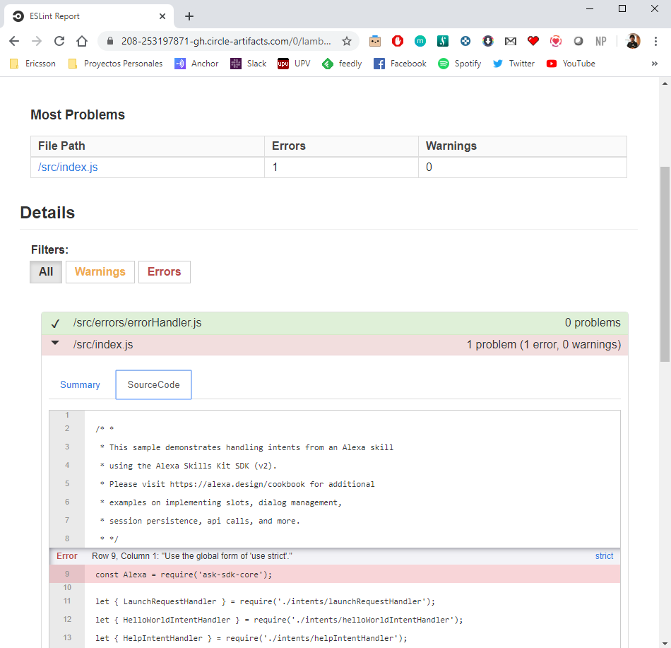

# DevOps your Skill: Static Code Quality Analysis

Without a doubt, one of the aspects a developer should pay more attention is trying to always generate understandable,
maintainable and clear code, in short, to generate clean code.

During the development of code (modules, libraries) it is important to integrate objective tools that measure the status of the code and provide the information to know its quality and thus be able to detect and prevent problems: duplicate functions, excessively complex methods, code low quality, non-standard coding style.

These checks are automated in the continuous integration system (CircleCI) and are executed in each new version of the software.

## Prerequisites

Here you have the technologies used in this project
1. ASK CLI - [Install and configure ASK CLI](https://developer.amazon.com/es-ES/docs/alexa/smapi/quick-start-alexa-skills-kit-command-line-interface.html)
2. CircleCI Account - [Sign up here](https://circleci.com/)
3. Node.js v10.x
4. Visual Studio Code

## ESLint

ESLint is a tool for identifying and reporting on patterns found in ECMAScript/JavaScript code, with the goal of making code more consistent and avoiding bugs.
We can find two types of rules. Some aimed at guaranteeing the quality of our code,
such as the detection of declared variables or functions that are not being used in our code, and others aimed at guaranteeing that the format of our code maintains certain homogeneity, such as the use of semicolons at the end of our instructions, spacing, etc.

ESLint allow us to automatically fix almost all the rules.

### Installation

You can install ESLint using npm. `--save-dev` is used to save the package for development purpose. Example: unit tests, minification.

```bash
    npm install eslint --save-dev
```

### Configuration

Once we have ESLint installed now we have to configure it. With ESLint you can define your own rules and in addition, you can also use a set of rules defined by a lot of big companies such as Airbnb, Facebook or Google. These set of rules are used by most of the npm packages.

In our case we are going to use the StrongLoop set of rules from IBM. This package can be installed with the following command:

```bash
    npm install --save-dev eslint-config-strongloop
```

Now it is time to configure this set of rules. First, we have to create the file `.eslintrc.json` in `lambda/cutom` folder:

```json
    {
        "extends": "strongloop",
        "parserOptions": {
            "ecmaVersion": 2019
        },

        "env": {
            "es6": true,
            "node": true,
            "mocha": true
        },
        "rules":{
            "max-len": [2, 120, 2]
        }
    }

```

As you can see, we extend from strongloop rules and we add some extra configurations:

1. We set `ecmaVersion` to 2019 in order to check the code with the modern format of JavaScript standard
2. In the `env` we set to true the following properties:
   1. `es6` like `ecmaVersion`, this is because of the JavaScript version.
   2. `node` because we are in a Node.js project.
   3. `mocha` due to the use of this library in our unit tests.
3. Finally, I have changed the `max-len` rule setting it to 120 characters instead of 80 defined by `strongloop` set of rules.

The las step is define the `.eslintignore` located in the same folder in order to specify the files that we do not want to check their style.

It is something like `.gitignore` file:

```properties
    node_modules/
    package-lock.json
    .DS_Store
    local-debugger.js
    *.xml
    mochawesome-report/
    .nyc_output/
    *.lcov
```

### Reports

Once we have everything configured, we have to set up the reports we are going to use to check our code quality.

The first report we need to set up is the JUnit report. 
This report will generate a .xml file as output that CircleCI is going to use to print the lint results:


We are going to move one step forward. We want to know a little bit more about our ESLint analysis in every pipeline execution.

This is why we are going to add the `eslint-detailed-reporter` npm package to generate a beautiful HTML report with more information rather than the above explained: 

```bash
    npm install eslint-detailed-reporter --save-dev
```

This is how this report looks like:



All these reports will be stored in `lambda/custom/reports/eslint/` folder.

### Integration

Now it is time to integrate it into our `package.json` to use it in our pipeline with `npm run` commands!

So, in this file we are going to add the following commands in the `script` json node:

1. `lint`: this command will execute the ESLint check and generates the JUnit report:
   1. `eslint . --format junit --output-file reports/eslint/eslint.xml`
2. `lint-fix`: this will automatically fic most of the code style errors_
   1. `eslint --fix .`
3. `lint-html`: this command will execute the HTML report using the npm package explained above:
   1. `eslint . -f node_modules/eslint-detailed-reporter/lib/detailed.js -o reports/eslint/report.html`

## Pipeline Job

Everything is fully installed, configured and integrated, let's add it to our pipeline!

This job will execute the following tasks:
1. Restore the code that we have downloaded in the previous step in `/home/node/project` folder
2. Run `npm run lint` to execute the ESLint checker.
3. Run `npm run lint-html` to execute the ESLint HTML report. It will be executed always either the job success or fails.
4. Store the JUnit report as CircleCi test artifacts.
5. Store the HTML report as an artifact of this job.
6. Persist again the code that we will reuse in the next job

```yaml
  pretest:
    executor: ask-executor
    steps:
      - attach_workspace:
          at: /home/node/
      - run: cd lambda/custom && npm run lint
      - run: 
          command: cd lambda/custom && npm run lint-html
          when: always
      - store_test_results:
          path: lambda/custom/reports/eslint/
      - store_artifacts:
          path: ./lambda/custom/reports/eslint/
      - persist_to_workspace:
          root: /home/node/
          paths:
            - project
```

## Resources
* [DevOps Wikipedia](https://en.wikipedia.org/wiki/DevOps) - Wikipedia reference
* [Official ESLint Documentation](https://eslint.org/) - Official ESLint Documentation
* [Official CircleCI Documentation](https://circleci.com/docs/) - Official CircleCI Documentation

## Conclusion 

The quality of a static analysis tools depends on various factors. 
The main ones are usually efficiency, clarity of your error reports and a low percentage of false negatives.
An advantage of static analysis tools is that they are usually easy to use. many are integrated directly into the IDE and only require the execution of only one simple command as we have seen with ESLint.

I hope this example project is useful to you.

That's all folks!

Happy coding!
