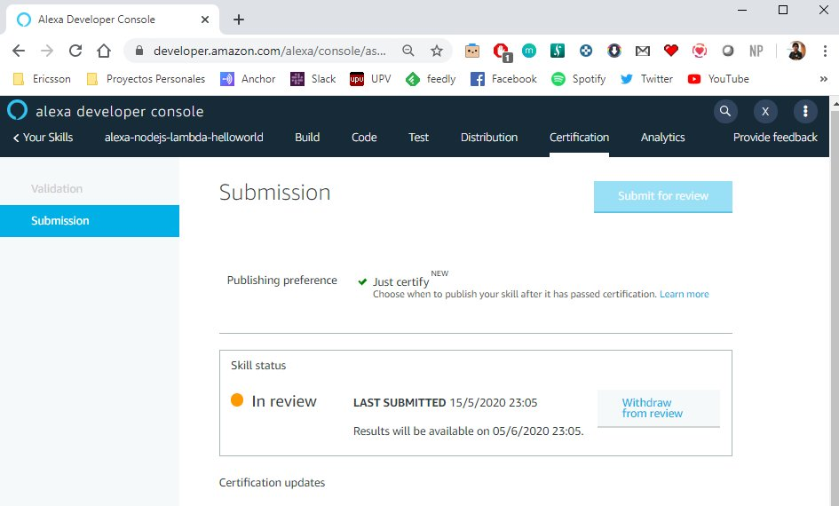

# DevOps your Skill: Submit

This is the last step of our pipeline. Previously we have run a lot of different tests and if everything is ok, it is time to submit our Alexa Skill to certification. It means, we have concluded the Continuous integration part, it is time to Continuous Deployment.

These step are automated in the continuous integration system (CircleCI) and are executed in each new version of the software.

## Prerequisites

Here you have the technologies used in this project
1. ASK CLI - [Install and configure ASK CLI](https://developer.amazon.com/es-ES/docs/alexa/smapi/quick-start-alexa-skills-kit-command-line-interface.html)
2. CircleCI Account - [Sign up here](https://circleci.com/)
3. Node.js v10.x
4. Visual Studio Code

## ASK CLI (Alexa Skill Kit CLI)

The Alexa Skills Kit Command Line Interface (ASK CLI) is a tool for you to manage your Alexa skills and related resources, such as AWS Lambda functions.
With ASK CLI, you have access to the Skill Management API, which allows you to manage Alexa skills programmatically from the command line.
We will use this powerful tool to validate our Alexa Skill. Let's start!

### Installation

The ASK CLI is included in the [Docker image](https://hub.docker.com/repository/docker/xavidop/alexa-ask-aws-cli) we are using so it is not necessary to install anything else.

### Submit

In this step of the pipeline we are going to submit our Alexa Skill using the ASK CLI.
When you submit your skill to the Alexa Store, it must pass a certification process from Amazon staff before it can be published live to Amazon customers.
We can use the following commands in the Skill Management API (SMAPI) to manage the certification and publication of an Alexa skill. 
In our case, we will only submit to certificate and not publishing it automatically, just certify. 

1. For ask cli v1:
```bash
    ask api submit -s ${skill_id} --publication-method MANUAL_PUBLISHING
```

2. For ask cli v2:
```bash
    ask smapi submit-skill-for-certification -s ${skill_id} --publication-method MANUAL_PUBLISHING
```

Those commands are integrated in the bash script file `test/submit/submit.sh`.

Here you can find the full bash script:

```bash
    #!/bin/bash
    skill_id=$1

    cli_version=$2

    echo "######### Submiting Skill for certification without publishing #########"

    if [[ ${cli_version} == *"v1"* ]]
    then
        submit=$(ask api submit -s ${skill_id} --publication-method MANUAL_PUBLISHING)
        exit 0
    else
        submit=$(ask smapi submit-skill-for-certification -s ${skill_id} --publication-method MANUAL_PUBLISHING)
        exit 0
    fi
```

This script has two parameters:
1. The id of the skill
2. The version of the ASK CLI you are running (v1 or v2). 

### Reports

There are not reports defined in this job.

But we can see in the [Alexa Developer Console](https://developer.amazon.com/alexa/console/ask) the new status of our Alexa Skill in the Certification tab:



### Integration

It is not necessary to integrate it in `package.json` file.

## Pipeline Job

Everything is ready to submit our Alexa Skill, let's add it to our pipeline!

This job will execute the following tasks:
1. Restore the code that we have downloaded in the previous step in `/home/node/project` folder
2. Run the `submit` script.

```yaml
  submit:
    executor: ask-executor
    steps:
      - attach_workspace:
          at: /home/node/
      - run: cd test/submit/ && ./submit.sh $SKILL_ID v1
```

**NOTE:** To perform these tests in CircleCI you have to set the environment variable `SKILL_ID` with the id of your Alexa Skill.


## Resources
* [DevOps Wikipedia](https://en.wikipedia.org/wiki/DevOps) - Wikipedia reference
* [Official Alexa Skill Management API Documentation](https://developer.amazon.com/es-ES/docs/alexa/smapi/skill-testing-operations.html) - Alexa Skill Management API Documentation
* [Official CircleCI Documentation](https://circleci.com/docs/) - Official CircleCI Documentation

## Conclusion 

Thanks to the ASK CLI we can perform this complex task.
This is the end, thank you for reading it until here!

I hope this example project is useful to you.

That's all folks!

Happy coding!
