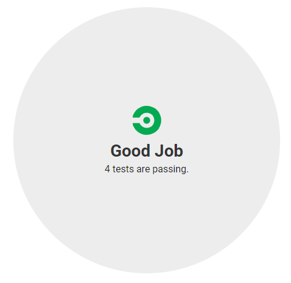
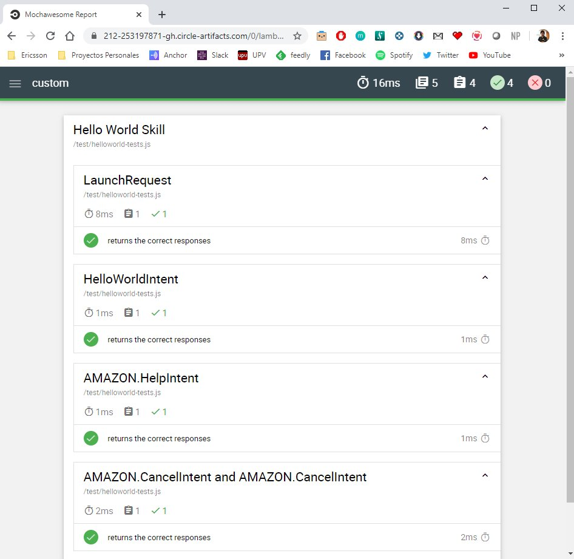

# DevOps your Skill: Unit Tests

A unit test is method that calls functions or piece of codes from your source code with some inputs 
and then validates if the output is the one that you want to expect. Thus, these tests validates if the result is the one expected.
The method or function to be tested is known as System under test (SUT).

These tests are automated in the continuous integration system (CircleCI) and are executed in each new version of the software.

## Prerequisites

Here you have the technologies used in this project
1. ASK CLI - [Install and configure ASK CLI](https://developer.amazon.com/es-ES/docs/alexa/smapi/quick-start-alexa-skills-kit-command-line-interface.html)
2. CircleCI Account - [Sign up here](https://circleci.com/)
3. Node.js v10.x
4. Visual Studio Code

## Alexa Skill Test Framework

We are going to use the npm package `ask-sdk-test` which is the newest version of the npm package `alexa-skill-test-framework`.

This new version is built in TypeScript and is really easy to use in both JavaScript and TypeScript Alexa Skills.

This framework makes it easy to create full-coverage black box tests for an Alexa skill using `Mocha`.

### Installation

You can install `ask-sdk-test` using npm. `--save-dev` is used to save the package for development purpose. Example: linters, minification.

```bash
    npm install ask-sdk-test --save-dev
```

This framework uses the npm package `mocha` to run the tests. So we need to install it as well:

```bash
    npm install mocha chai --save-dev 
```

### Writing Tests

Once we have the test framework installed and its dependencies now we have to write some unit tests. 

You can find all the tests in the `helloworld-tests.js` in `lambda/cutom/test` folder.

We are going to explain step-by-step this file.

First, the initialization of the test framework and the i18n library is required to write some unit tests:

```javascript
    // include the testing framework
    const test = require('ask-sdk-test');
    const skillHandler = require('../src/index.js').handler;
    // i18n strings for all supported locales
    const languageStrings = require('../src/utilities/languageStrings.js');
    const i18n = require('i18next');


    // initialize the testing framework
    const skillSettings = {
    appId: 'amzn1.ask.skill.00000000-0000-0000-0000-000000000000',
    userId: 'amzn1.ask.account.VOID',
    deviceId: 'amzn1.ask.device.VOID',
    locale: 'es-ES',
    };

    i18n.init({
    lng: skillSettings.locale,
    resources: languageStrings,
    });

    const alexaTest = new test.AlexaTest(skillHandler, skillSettings);

```

With the lines above now we can start writing unit tests as easy as this:

```javascript

    describe('Hello World Skill', function() {
        // tests the behavior of the skill's LaunchRequest
        describe('LaunchRequest', function() {
            alexaTest.test([
            {
                request: new test.LaunchRequestBuilder(skillSettings).build(),
                saysLike: i18n.t('WELCOME_MSG'), repromptsNothing: false, shouldEndSession: false,
            },
            ]);
        });

        // tests the behavior of the skill's HelloWorldIntent
        describe('HelloWorldIntent', function() {
            alexaTest.test([
            {
                request: new test.IntentRequestBuilder(skillSettings, 'HelloWorldIntent').build(),
                saysLike: i18n.t('HELLO_MSG'), repromptsNothing: true, shouldEndSession: true,
            },
            ]);
        });

        // tests the behavior of the skill's Help with like operator
        describe('AMAZON.HelpIntent', function() {
            alexaTest.test([
            {
                request: new test.IntentRequestBuilder(skillSettings, 'AMAZON.HelpIntent').build(),
                saysLike: i18n.t('HELP_MSG'), repromptsNothing: false, shouldEndSession: false,
            },
            ]);
        });

        describe('AMAZON.CancelIntent and AMAZON.CancelIntent', function(){
            alexaTest.test([
            { request: new test.IntentRequestBuilder(skillSettings, 'AMAZON.CancelIntent').build(),
                says: i18n.t('GOODBYE_MSG'), shouldEndSession: true },
            { request: new test.IntentRequestBuilder(skillSettings, 'AMAZON.CancelIntent').build(),
                says: i18n.t('GOODBYE_MSG'), shouldEndSession: true },
            ]);
        });

    });

```


### Reports

Once we have everything configured, we have to set up the reports we are going to use to check the output of the unit tests.

The first report we need to set up is the JUnit report. 

We need to install this output format of the report:

```bash
    npm install mocha-junit-reporter --save-dev 
```

This report will generate a .xml file as output that CircleCI is going to use to print the lint results:



We are going to move one step forward. We want to know a little bit more about our unit tests results in every pipeline execution.

This is why we are going to add the `mochawesome` npm package to generate a beautiful HTML report with more information rather than the above explained: 

```bash
    npm install mochawesome --save-dev
```

This is how this report looks like:




Finally, in order to generate two reports with just one command we will install another npm package: `mocha-multi-reporters`

```bash
    npm install mocha-multi-reporters --save-dev
```

Then we have to configure this npm package to specify the two reporters we are going to run ant its configuration. 

The configuration file is `mocha.json` file in `lambda/custom` folder:

```json
    {
        "reporterEnabled": "mocha-junit-reporter, mochawesome",
        "mochaJunitReporterReporterOptions": {
            "mochaFile": "reports/mocha/test-results.xml"
        }
    }  
```

The JUnit report will be stored in `lambda/custom/reports/mocha/` folder and the HTML one will be stored in `lambda/custom/mochawesome-report`.

### Integration

Now it is time to integrate it into our `package.json` to use it in our pipeline with `npm run` commands!

So, in this file we are going to add the following commands in the `script` json node:

1. `test`: this command will execute the unit tests and generates the reports:
   * `mocha --reporter mocha-multi-reporters --reporter-options configFile=mocha.json`

## Pipeline Job

It is fully installed, configured and integrated, let's add it to our pipeline!

This job will execute the following tasks:
1. Restore the code that we have downloaded in the previous step in `/home/node/project` folder
2. Run `npm run test` to execute the unit tests.
3. Store the JUnit report as CircleCi test artifacts.
4. Store the HTML report as an CircleCi artifact of this job.
5. Persist again the code that we will reuse in the next job

```yaml
  test:
    executor: ask-executor
    steps:
      - attach_workspace:
          at: /home/node/
      - run: cd lambda/custom && npm run test
      - store_test_results:
          path: lambda/custom/reports/mocha/
      - store_artifacts:
          path: ./lambda/custom/mochawesome-report/
      - persist_to_workspace:
          root: /home/node/
          paths:
            - project
```

## Resources
* [DevOps Wikipedia](https://en.wikipedia.org/wiki/DevOps) - Wikipedia reference
* [Official Alexa SDK Test Framework Documentation](https://github.com/taimos/ask-sdk-test) - Alexa SDK Test Framework Documentation
* [Official CircleCI Documentation](https://circleci.com/docs/) - Official CircleCI Documentation

## Conclusion 

The main goal of unit tests is to detect errors within individual software components.
The idea is to ensure the accuracy of the code throughout the development process.
It is necessary to write unit tests constantly. 

I hope this example project is useful to you.

That's all folks!

Happy coding!
